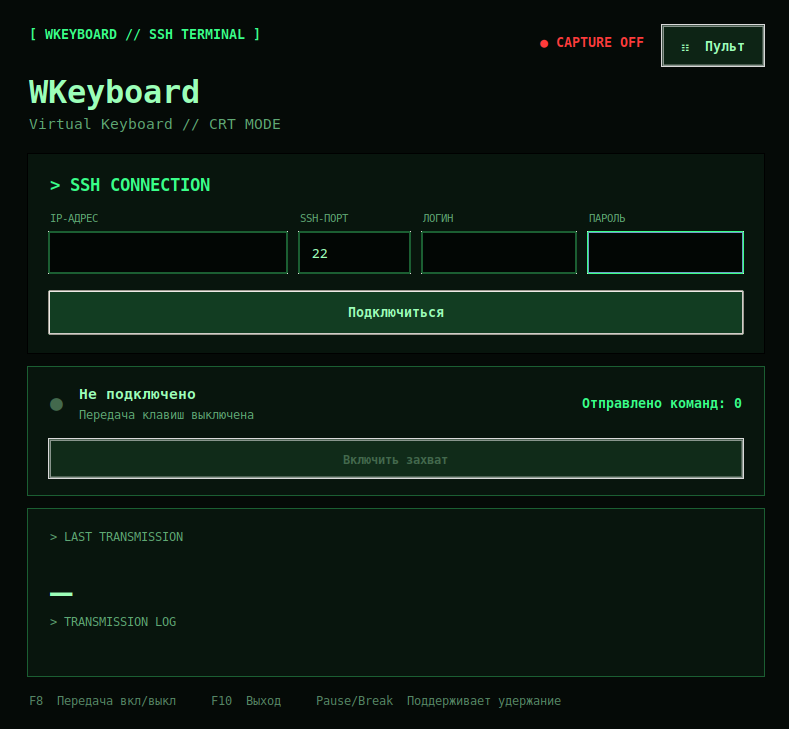

# WKeyboard

Небольшое Debian-приложение для управления совместимыми терминалами через их встроенный SSH API. На удалённом устройстве ничего устанавливать и настраивать не нужно — достаточно SSH-доступа к API.



## Как это работает

Клиент подключается по SSH и для каждого нажатия отправляет документированную API-команду `button key <key>`. Например, Enter передаётся как `button key Return`, а стрелка вверх — как `button key Up`. API терминала сам преобразует запрос в событие пульта.

После подключения доступны два режима без разрыва SSH-сессии:

- **Захват клавиатуры** — физические клавиши рабочего компьютера передаются терминалу;
- **Пульт** — боковая панель с навигацией, громкостью, камерой, раскладкой, вызовом и цифровым блоком.

Открытие пульта выключает захват клавиатуры. Кнопка «Включить захват» возвращает приложение в режим клавиатуры.

## Установка и запуск на рабочем Debian

```bash
sudo apt install python3-tk python3-venv
python3 -m venv .venv
.venv/bin/pip install -r requirements.txt
chmod +x terminal-key-bridge
./terminal-key-bridge
```

Заполните адрес, SSH-порт, логин и пароль, затем подключитесь. Передача включится автоматически, а счётчик в окне покажет отправленные нажатия. После подключения:

- `F8` включает или выключает передачу клавиш;
- `F10` закрывает приложение;
- Pause/Break передаёт длительность физического удержания через `button -t <миллисекунды> key Pause`;
- окно приложения должно оставаться активным.

Пароль хранится только в памяти процесса. Первое подключение принимает ключ нового SSH-хоста; изменение уже известного системного ключа будет отклонено.

## Требования

- рабочий компьютер: Debian/Ubuntu, Python 3.10+, Tk и Paramiko;
- удалённый терминал: только доступный SSH-сервер;
- никаких файлов, пакетов, `sudoers` или служб на терминале не требуется.
